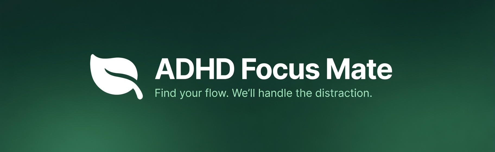

<div align="center">
  
</div>

<h1 align="center">ADHD Focus Mate</h1>

<div align="center">
  <strong>The AI companion that knows what you should be doing and gently reminds you when you get distracted.</strong><br>
  Private. Open Source. AI-Powered.
</div>

<div align="center">
  <br>
  <!-- Badges -->
  
  
  
  
  
</div>

<br>

<p align="center">
  <a href="#quickstart">Quickstart</a> •
  <a href="#why-i-built-this">Why I built this</a> •
  <a href="#features">Features</a> •
  <a href="#how-it-works">How it works</a> •
  <a href="#privacy--data">Privacy & Data</a> •
  <a href="#installation">Installation</a> •
  <a href="#troubleshooting">Troubleshooting</a>
</p>

---

## What is ADHD Focus Mate?

**ADHD Focus Mate** is a native macOS menu bar app that helps you stay in the "Flow State" by watching your screen. It is built purely in SwiftUI, making it **super lightweight** and resource-efficient (uses <1% CPU). It's also **extremely cheap** to run—optimized for token efficiency so it costs next to nothing (often **<$1/month**).

Unlike traditional timers that just count down, **Focus Mate uses AI to understand what you're looking at**. It quietly monitors your screen at your chosen interval. If it sees you working on your goal (e.g., Coding, Writing), it leaves you alone. But if it catches you doom-scrolling Reddit or watching YouTube when you *should* be working, it gives you a gentle, judgment-free nudge to get back on track.

> **Privacy-First**: Screenshots are analyzed in-memory and **instantly discarded**. Your screen history is **never** saved to disk or trained on.

---

## See it in Action

https://github.com/user-attachments/assets/ca3f26c7-788c-4bb5-af6d-0ce3462f3b3d

---

## Why I built this

I built Focus Mate because whenever I sit down to code, I eventually drift. 

One minute I'm debugging a function, and the next—without even realizing it—I'm scrolling X (Twitter) or watching TikToks. I lose track of time completely. 10 minutes turns into 45, and my flow is dead.

I thought it would be really cool to have an app that actually *knows* what I'm doing. Not just a dumb timer, but something smart enough to track my context and gently remind me if I lose focus.

So I built it. **ADHD Focus Mate** is that intelligent companion—it sees when you're working, notices when you drift, and helps you stay in the zone without being annoying.

---

## Features

- **🧘 Zen Timer**: A beautiful, unobtrusive "Zen Pill" in your menu bar that shows your status at a glance.
- **👁️ It Knows What You're Doing**: Uses smart AI to understand your screen, so it knows the difference between "working" and "wasting time".
- **🚫 Distraction Nudges**: A gentle notification breaks your "doom-scrolling" trance before you lose hours.
- **🔍 Recognize & Fix Patterns**: It spots your specific distraction triggers (like Twitter or Steam) and analyzes your patterns to help you understand and fix your focus habits.
- **📅 Session History**: Review a detailed log of your focus sessions to track exactly what you worked on throughout the day.
- **💸 Wallet Friendly**: Built with a **Token Optimization Philosophy**. We use smart image compression and efficient prompting to keep payload sizes tiny, ensuring costs stay extremely low (often <$1/month) even with all-day usage.

## Roadmap

We have big plans to make Focus Mate the ultimate productivity tool:

- **🔮 Local AI Support**: We are working on supporting **local LLM/VLM models** (like Ollama or CoreML). This will allow the app to run **100% offline**, be **fully private**, and **completely free forever**.
- **📊 Advanced Insights**: Deeper analytics to help you understand your productivity flow.
- **⚡️ Shortcuts Integration**: Control Focus Mate with macOS Shortcuts.

---

## How it works

The app operates on a simple "Capture → Analyze → Feedback" loop designed to be lightweight and private.


1. **Capture**: At your chosen interval (1-5 minutes), the app takes a screenshot.
2. **Analyze**: The image is sent to the Gemini API (`gemini-2.5-flash-lite` by default) along with your personalized focus context.
3. **Classify**: The AI responds with a classification (e.g., `label: slack`, `category: social_media`).
4. **Action**:
   - If **Work**: Increase your Focus Streak. 🎉
   - If **Slack**: Send a nudge notification + enter "Cooldown Mode" (so it doesn't spam you).
5. **Privacy**: The screenshot is **immediately deleted** from memory. It rarely exists for more than 2 seconds.

---

## Privacy & Data

We believe that anything watching your screen must be **radically transparent**.

### 1. We don't collect your data
Everything stays on your Mac. Your logs, stats, and history are stored locally using **SwiftData**. We have no servers, so we couldn't steal your data even if we wanted to.

### 2. What leaves your Mac?
The only data that leaves your computer is the **current screenshot** sent to **Google Gemini** for analysis. It is processed and then immediately forgotten.

### 3. How to stay 100% private
Since you use your own API Key, you are in control.
- **Paid Tier (Recommended)**: If you enable billing on your Google Cloud project (even if you stay within free quotas), Google [states](https://ai.google.dev/gemini-api/terms) they **do not train** on your data. This is the best way to ensure privacy.
- **Free Tier**: If you use the completely free tier, Google *may* use anonymized data to improve their models.

---

## Installation

### Requirements
- macOS **14.0 (Sonoma)** or later.
- A **Gemini API Key**: You can get one [completely free here](https://aistudio.google.com/app/apikey)—no credit card required. The free tier has generous limits that work great for this app.
  - **Why Paid?** While the free tier works perfectly, we recommend enabling billing on your Google Cloud project to ensure Google [does not train](https://ai.google.dev/gemini-api/terms) on your data.
    - **Free $300 Credit**: New Google Cloud accounts typically get **$300 in free credits**. This is enough to run this app privately for years without paying a cent.
    - **Low Cost**: Even without credits, the app usually costs **<$1/month** to run.
  - **Model Choice**: We recommend using a lightweight, cost-efficient model like **`gemini-2.5-flash-lite`**. The classification task is simple enough that you don't need a more powerful (and expensive) model.

### Install via Homebrew (Preferred)
Install via [Homebrew](https://brew.sh/) to get autoupdates.
```bash
brew install --cask skainguyen1412/tap/adhd-focus-mate
```

### Manual Install
You can also install manually:
1. Download the latest available zip from [releases page](https://github.com/skainguyen1412/adhd-focus-mate/releases)
2. Unpack zip
3. Put unpacked `ADHD Focus Mate.app` into `/Applications` folder

> [!NOTE]
> This app is **signed and notarized** by Apple, so you should not see any security warnings when opening it.

### Build from Source
1. **Clone the repo**:
   ```bash
   git clone https://github.com/skainguyen1412/adhd-focus-mate.git
   cd adhd-focus-mate
   ```
2. **Install Tuist**:
   ```bash
   curl -Ls https://install.tuist.io | bash
   ```
3. **Generate Project**:
   ```bash
   tuist install
   tuist generate
   ```
4. **Run**:
   Open `ADHDFocusMate.xcworkspace`, select the `ADHDFocusMate` scheme, and hit `Cmd+R`.

---

## Troubleshooting

### "Permission Required" Loop
Sometimes macOS gets stuck. 
1. Open **System Settings** → **Privacy & Security** → **Screen Recording**.
2. Remove **ADHD Focus Mate** (click `-`).
3. Restart the app and grant permission again.

### API Connection Failed
- Ensure you copied the full API key (starts with `AIza...`).
- Check if your quota is exceeded on [Google AI Studio](https://aistudio.google.com/).
- If using Vertex AI, ensure your project is properly configured.

### Notifications Not Working
1. Open **System Settings** → **Notifications**.
2. Find **ADHD Focus Mate** and ensure notifications are enabled.
3. Check that "Allow Notifications" is turned on.

---

## Contributing

We welcome contributions!
- **Bug Reports**: Open an issue.
- **Feature Requests**: We love new ideas for visualization or AI prompts.
- **PRs**: Please follow the SwiftLint rules and ensure tests pass (`tuist test`).

---

## Acknowledgements

- **[Dayflow](https://github.com/JerryZLiu/Dayflow)**: A really cool app with an awesome idea—automatically creating a timeline of your day. It was a huge inspiration for me to make this.

---

## License

MIT License. See [LICENSE](LICENSE) for details.

<p align="center">
  <em>Made with 🍃 (Hyperfocus)</em>
</p>
